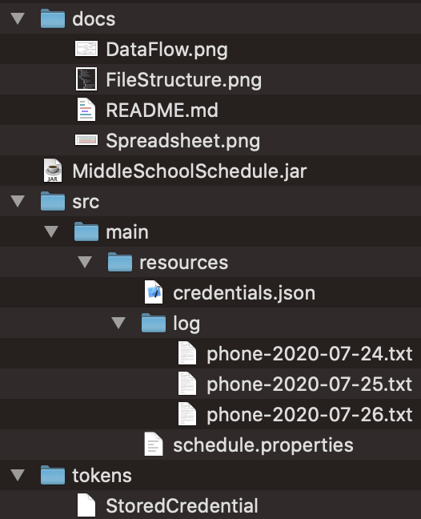

# Middle School Schedule
## by: Miles Henle

#### DESCRIPTION
\
This program accepts texted commands and responds with information periodically taken from a database. The commands are sent through a Twilio virtual phone number. Twilio converts the text messages to HTTPS POST requests and sends it to the program. The program sends back a response, which Twilio converts back into a text message and sends to the user. The database is a Google Spreadsheet.

This project is intended for use by Suffield Middle School, but can be expanded on for other cases. This project requires you to supply your Twilio account with money for inbound and outbound messaging fees. The owner/admin of the spreadsheet has total control over the spreadsheet. Everyone else is restricted to the editing boxes highlighted in various colors. The admin can expand editing boxes, but must follow the instructions carefully.
    
* A typical invocation of this program looks like `java -jar /path/to/MiddleSchoolSchedule.jar -DproPath=app/example/path -Dlimit=50`. Replace the example words with the real path as needed. The paths of the files and folders are automatically typed in if you drag the icon into the terminal. I also recommend changing directory to the encompassing folder if possible, especially if you plan on making changes to any file paths. This can be done with `cd "/path/to/folder"`. This will take care of the paths the first time, allowing you to call the program with only the JAR name.

#### COMMANDS

* Commands are split into 3 categories: School, Day, and Event Type. The order does not matter, nor does spacing or spelling, as long as the words exist. `23e@fRIdaY-04]GaMEs';^` can still pick out "friday" and "games." If multiple instances of the same category are found, the program will default to the first one in the list, not the first on in the command. `games lunch` will return the lunch menu because it is listed first.

    * School: `SMS`. Defaults to `SMS` if no school is given.

    * Day: `Monday`, `Tuesday`, `Wednesday`, `Thursday`, `Friday`, `Saturday`, `Sunday`, `Today`, `Tomorrow`. `Today` and `Tomorrow` assign the weekday based on when the command was received. Defaults to `Today` if no day is given.

    * Event: `Lunch`, `Breakfast`, `Games`, `Practices`, `Clubs`, `Intramural`, `News`, `PTAC`. Special commands, which replace the event type, are `List` and `FullHelp`. They name every command and explain the structure, with the latter command being more comprehensive. The event must be given. Any command without a recognizable event type will instead tell the user to type "list" if they want a list of commands.

* Events are also separated by date. The program will also place a warning on any date that does not match the corresponding weekday. Depending on how the spreadsheet is scheduled, you may find multiple weeks worth of entries for a particular weekday.

#### INSTALLATION

\
Your end product should resemble this when complete. All of the files, except the `phone[date].txt` files, can be downloaded from this repository. If you are not given the file hierarchy separately, then you will make it yourself. Name the folders as seen above. This is all contained in a larger folder, whose name does not matter. The given credentials are for `smsstuco@gmail.com`, which give this program the same permissions as the account itself. If you are tying this to your own Gmail, then you will provide `credentials.json`, and `StoredCredential` will be created when you first run the code. The `phone[date].txt` files will be created when the program receives the first message of that day.

1. Properties

    * The `schedule.properties` file's default path is `src/main/resources/`. It's path can be changed if you want it in a different location. Add `-DproPath=app/example/path` to the command line when running the program.

    * All properties in the file can also be changed in the command line. Their system property names are identical to the ones in the file. `-Dlimit=50` will be a typical change.

    1. Log in to your Twilio Account [here](https://www.twilio.com/login), or make a new one. Copy the Account SID and paste with the `TwilioID` line of `schedule.properties` in the resources folder. This ensures that the program only responds to POST requests from **your** account.

    2. Create a password and enter it into the `password` line of `schedule.properties`. This will be used later for another layer of security. Beware of special HTTP formatting.

    3. Create a Google Spreadsheet. You must copy it from the template here: (https://docs.google.com/spreadsheets/d/1QO8fHedJbx6vxmhYS0U85K8SFER1Gwg3t27rhXrGweQ/edit?usp=sharing). Make sure that whomever does this uses the correct Google account. Only the admin can change the cell arrangement. All others will be restricted to the editing boxes (more on those later). In the URL, you will find a long string of random characters, separated by slashes. Copy and paste it into the `GoogleID` line of `schedule.properties`. For reference, the template's ID is `1QO8fHedJbx6vxmhYS0U85K8SFER1Gwg3t27rhXrGweQ`. Be sure to disable the sharing link if you want to invite personnel individually.

        * If the link does not work, then you will have to recreate this on your own. Find detailed instructions for this below.

    4. `GoogleName` is unimportant, but it must exist. It will be passed to the Google Sheets API when reading the spreadsheet.

    5. `limit` specifies the number of times any one user may send a command to the program in a given interval of time. After reaching the limit, the user will be warned and given links to the website for the complete schedule. All future requests will not be responded to until the interval has passed. This is to protect against large Twilio bills from potential message bots. 

    6. `limitInterval` is the length of time before resetting the command count of each user. It is counted in milliseconds: 60000 for 1 minute. Do not use any kind of arithmetic signs. It is read as a string, so `10 * 60000` will result in an error. Consider a reasonable limit with a long interval. If someone sends 10 commands, they probably will not have more questions for most of that day. If the user actually wanted the entire week's schedule, it would be easier for them to go to the website anyway. 15 commands in 6 hours is what I would recommend, but you decide. The program also adjusts the timing to align the interval with the clock. 15 min interval results in 1:00 -> 1:15 -> 1:30. The program currently prints the time to the console every interval, but this can be changed easily.

    7. `limitMessage` is the human representation of `limitInterval`, which will be given to the user upon reaching `limit`. 600000 milliseconds = 10 minutes.

    8. `updateInterval` is the length of time (milliseconds) before checking the spreadsheet. The program reads the spreadsheet information and updates its memory, which will be used until the next interval. Set longer intervals to reduce processing power, if so desired. Google has a limit of 100 requests in 100 seconds, and each interval uses several requests, so be reasonable. This is also adjusted to match the clock.

    9. `credPath` is the path of credentials.json (more on that later).

    10. `logPath` is the path of the `phone[date].txt` files.

2. TWILIO

    1. Buy a Twilio virtual phone number. Be sure to search for the correct area code to minimize time lag.

    2. In that number's settings, scroll down until you see "A Message Comes In." Set that entry to "Webhook" and "HTTP POST".

    3. In the box, set the URL as the server domain, followed by "text," followed by `password` from earlier. It should resemble `server.domain.org/text/abc123`. Click "Save" to finalize the changes.

    * If you are using the given credentials, then the program should now be fully operational. Run the JAR to start the program.

3. GOOGLE SHEETS

    * This only applies if you are making your own credentials and tying them to your own Gmail account.

    * The account should be a spare account without access to sensitive information in Google Drive. The program is not capable of doing anything other than reading from the spreadsheet it is given, but it is still granted the access to anything in the account's Google Drive. This account should be granted viewing privileges to the spreadsheet and nothing else. **I insist that you do not tie this to the spreadsheet owner account.**

    1. Sign in to the desired Gmail account. Go to the Java Quickstart of the Google Sheets API [here](https://developers.google.com/sheets/api/quickstart/java) and click the blue icon with "Enable the Google Sheets API."
    
    2. I do not believe the name matters, but enter "Middle School Schedule" just to be sure and advance. Leave the drop-down menu as "Desktop App" and click "Create." Download the Client Configuration and leave the file name unchanged. This will create `credentials.json`. The Client Secret and ID are not used.
    
    3. Drag the file to the resources folder (or whichever replacement you decide on).

4. FIRST RUN

    * This only applies if you are making your own credentials and tying them to your own Gmail account.

    1. Run the JAR file. It will automatically take you back to Google's login page.
    
    2. Sign in to the same Gmail account again. It will warn you that this app is not verified. I will try to get past this somehow, but for now, click "Advanced" and "Go to Quickstart (Unsafe)."
    
    3. Grant permissions to the app. The program will now create `StoredCredential` in the `tokens` folder.
    
    4. The app should now be fully operational.

#### MAINTAINENCE

1. LOGGING

    * All HTTP POST requests are recorded in the `phone[date].txt` files. The timestamp is in ISO 8601 format. The entry is formatted like this: `+18609665991	2020-06-26T11:18:32EDT	Thursday games`. The files are separated by day, and a new file is made on the first message of each day.

    * All Google related connection errors are printed to console. I can configure the program to write them to a text file instead, if you desire more permanent logging. Connection errors related to Twilio are not detectable, since the program will never know that the POST request was called in the first place. Twilio's website itself will keep track of errors on their end.

        * Unable to Connect: generated by an UnknownHostException. Generally means that the connection could not be formed.

        * Connection Lost: generated by a ConnectionException. Generally means that the connection existed but was broken midway.

        * All other exceptions will be first identified as an IOException or a GeneralSecurityException, with the former being more common. It will then be followed by a description of the specific exception.

2. TWILIO

    * Twilio keeps track of messaging traffic with a line chart. Messages exceeding 160 characters are treated like multiple ones and will be charged as such. No commands should exceed 160 characters, so beware of anyone trying to accumulate a large inbound message fee with massive and/or repeated messages. The program detects spam through `limit` and `limitInterval`, which you set earlier, but it cannot prevent the inbound message fee. If an unusually high fee is charged, check the corresponding `phone[date].txt` file to look for repeated commands. Responses can exceed 160 characters either through the help responses (which list every command) or larger event types like `Games` and `Practices`.

3. GOOGLE SHEETS

    * Gmail Accounts

        * In order to tie this program to a new Gmail account, delete `credentials.json` and `StoredCredential`, then follow steps 3 and 4 to make new credentials.

        * In order to transfer ownership of the spreadsheet, go to "Share" and find the desired account. Click on their status menu, which has "Editor," "Commentor," and "Viewer" as its options. Click on "Make owner" and confirm the decision. Be sure to also grant them admin privileges.

         * The admin is anyone who can make changes outside of the designated editing boxes. The owner of the spreadsheet should always be an admin. If multiple people are managing the spreadsheet, others may be granted the right.

            * In order to grant access, first make sure you are not highlighting any range of cells, then click on "Data" -> "Protected sheets and ranges" -> "SMS except [number] ranges" -> "Change permissions" -> "Custom." Select other people as if you were sharing the spreadsheet with them.

            * **Standard personnel are not to be granted access. Only the manager(s).** This restricts people from screwing around with the data validation and cell arrangement. Only someone who has read this document is allowed to edit the format. All others are to leave their requests for you or another admin to solve. If you think that everyone should be allowed to edit the format, then **PLEASE** at least make them read this, if only the GOOGLE SHEETS part of MAINTAINENCE. Then they can change the cell arrangement without breaking the program. Change the protected sheet permissions to "Show a warning when editing this range." This will warn anyone, even you, when making changes outside the boxes. They can either acknowledge the warning or cancel the change.

            * The admin of the spreadsheet is allowed to make any changes outside of the boxes that they wish. In fact, I recommend leaving helpful notes about the drop-down calendar and the desire to keep descriptions short.

    * Spreadsheet Arrangement

        * For each event type, figure out the maximum number of events that should be plausible to reach in any day. Estimate high, since some personnel might leave the entries in after the day has passed, while others might put in entries an entire week in advance, giving you up to 2 day's worth of entries. With that in mind, I recommend that each event type have a minimum of 2 rows. There is no upper limit, but remember that more entries -> more characters -> higher Twilio fees. You can also create a guideline for people to follow, like "Schedule no more than 7 days in advance and remove entries after the day is over." The admin of the spreadsheet is allowed to expand the ranges of the editing boxes. Follow these instructions in order to do so.

        * The admin is also the only one who can change the length of the columns. I recommend finding a length that encourages reasonably short event descriptions.

        1. Highlight any bottom pair of cells in the range you wish to modify.

        2. Right click on the highlighted section. Select "Insert 2 rows" in order to expand the range. Select "Delete rows [number range]" to shrink it. This will extend all of the formatting and data validation into the new rows. Repeated use may leave holes in the formatting, namely the darkened border. Repair them as necessary.
    
            * Note that the lower cell of each pair should accept valid dates **only**, formatted as `Tue, Aug 5`, and offer a drop-down calendar when double-clicked, for selecting dates.

        3. The named ranges should expand/shrink automatically, but check to be sure. The program can only read in the named ranges. The editors are only allowed to type within the protected areas, so check those too. Make sure that both of them match the colored boxes. Select "Data" in the upper right corner and click on "Named Ranges." The list of ranges will appear on the right hand side of the screen. The range can be found underneath the name. `SMS!C7:I10` means that it extends from row `7` of column `C` to row `10` of column `I` (like Battleship) inside of the SMS sub sheet.

            * **You are not to change the names of the ranges.** This will severely disrupt the program's ability to read information from the spreadsheet.
    
#### SPREADSHEET CREATION

* Follow these steps **to the letter** in order to recreate the spreadsheet. You can continue with the regular installation steps once the blank sheet is made and you have the spreadsheet ID, but you will have to complete this before first running the code.

* Again, the event types are `Lunch`, `Breakfast`, `Games`, `Practices`, `Clubs`, `Intramural`, `News`, `PTAC`.

1. Type "Event Types" in cell `A1`. Type "Lunch," or whichever event type goes first, in cell `A2`; the order does not matter. Label cells `B1` and `B2` as "Description" and "Date" respectively. Label columns `C-I` at the top as Monday-Sunday. This format will be continued with each event type, as seen above.

    * This bit really does not matter, but rename the sub sheet on the bottom left to "SMS," for consistency.

2. Highlight cell range `C2:I3` and do the following. These steps replicate the appearance seen above and are mostly optional. Create your own style if you wish.

    * Find the "Cell borders" option. This version uses the second "Border style." Click on "Outer borders" and "Vertical borders" to pair up the cells. Deviation from this is allowed, but you should find some way to pair up the description and date cells.

    * Find the "Fill color" option and choose a color for this box. This version uses "Light" colors 1 and 2.

3. Highlight cell range `C3:I3` (the date cells) and do the following. This is **not optional**.

    1. Click on "Data," then "Data validation." Choose "Date" and "is a valid date" in "Criteria." Click on "Reject input" and "Show validation help text," then save.

    2. Click on "Format" -> "Numbers" -> "More formats" -> "More date and time formats." Make a custom format with, `Day (Tue)`, `Month (Aug)`, and `Day (5)`, in that order, with a comma and space after the weekday. The resulting format appears as `Tue, Aug 5`. Also set the horizontal alignment to left, for consistency.

    3. Test the changes by double-clicking on one of the date cells. This should summon a drop-down calendar from which you can select a date. Clicking on a day should automatically type that date in the correct format. 

4. Highlight cell range `C2:I3` and copy it. Click on cell `C4` and paste to add a second row to the editing box. This should copy all of the formatting and data validation, but check to be sure. Copy cell range `B1:I5`. Click on cell `B6` and paste to add another box. Repeat this process for each event type and label them in column `A`. Change the colors of the different boxes for convenience.

5. Highlight cell range `C2:I5`, the colored box, right click, then select "Define named range." Type in the event type as the range name. Repeat this for all event types.

6. Click on "Data" -> "Protected sheets and ranges" -> "Add a sheet or range" -> "Sheet" -> "Except certain cells." Add all of the event types. You can do this by typing their names, instead of their cell values. This will restrict all editing to the colored boxes. Click "Change permissions" to finalize the restrictions. Leave the option as "Restrict who can edit this range" and "Only you."

    * See the notes in MAINTAINENCE regarding editing permissions.

7. You are now going to make a "Comments and Requests" section. Add at least 10 rows to the top of the spreadsheet. Right click on cell `A1` and select "Insert row." Redo that action several times until you have enough spaces for people to leave requests that the admin will address. Horizontal merge columns `A-B` and `C-I`. Type "Name" in cell `A1` and bold it. Type "Comments and Requests in cell `C1` and bold it. Also you probably want make borders for it. Now make a named range in `A2:I[bottom]` and add it to the protected sheet.